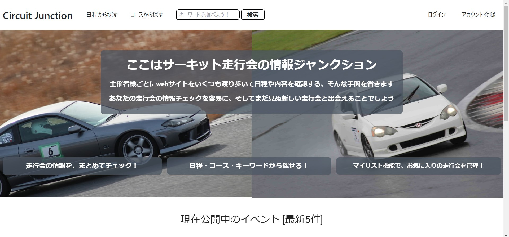
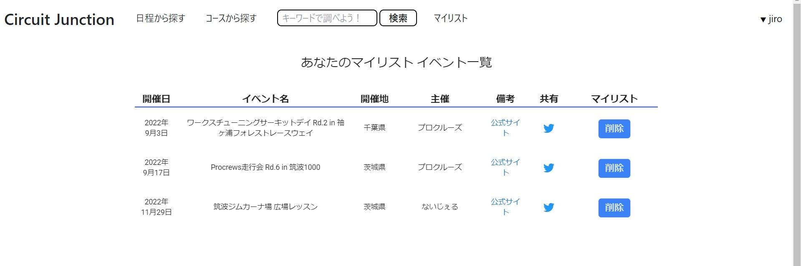

# Circuit Junction

サーキット走行会の情報をまとめて閲覧・管理できるサービスです。

# 概要

全国各地で開催されているサーキット走行会の情報を、主催者webサイトをスクレイピングすることで取得しています。 
走行会の情報を、日程・コース・キーワードで検索、ログインによるマイリスト管理などができます。 
Laravelのbladeの中でVue.jsを表示しています。

# 画面イメージ
- HOME画面

- 開催月で検索

- マイリスト画面

# 環境・パッケージ
- Laravel：8.52.0
- Vue.js：2.6.12
- TailwindCSS：2.2.19
- Goutte：2.1
- MySQL：8.0.24

# 開発者

Kyohei Tashiro 
email:rgz.aqua@gmail.com

